# COCO PAY
<div align="center">
  
</div>

## 🏆삼성 청년 SW아카데미(SSAFY) 9th 특화프로젝트 최우수상(1위)🏆

## ✅ 프로젝트 진행 기간

2023.08.28 ~ 2023.10.05

## ✅ 팀 모토 및 그라운드룰 사진
<div align="center">
  
</div>

## ✅ 멤버소개


## ✅ 기술스택

## :pushpin: 기술 스택

<table>
    <tr>
        <td><b>Back-end</b></td>
        <td>


<br>


<br>


</td>
    </tr>
    <tr>
    <td><b>Front-end</b></td>
    <td>


    </td>
    </tr>
    <tr>
    <td><b>Infra</b></td>
    <td>


</td>
    <tr>
    <td><b>Tools</b></td>
    <td>
    
    

    </td>
    </tr>
</table>

## ✅ 시스템 아키텍쳐

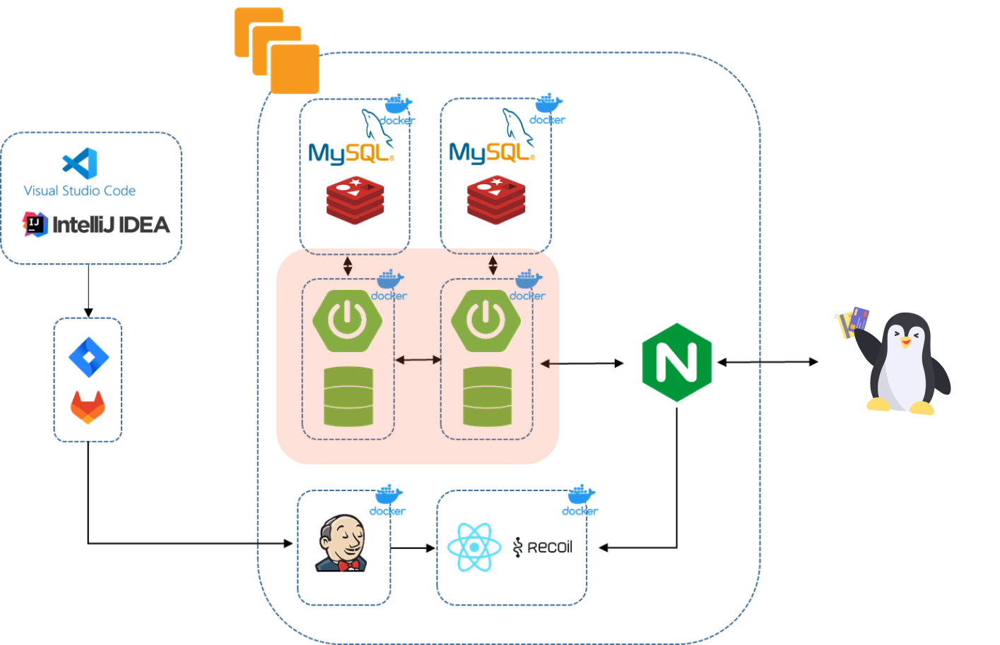

## ✅ 프로젝트 소개

**🚩 서비스 한줄 소개**

카드 결제시, 소비자가 보유한 카드 중 소비처별 최적의 할인과 실적 현황을 고려하여
합리적인 소비를 돕는 “카드 오토체인징 페이먼츠 시스템”

▪️**기획의도 및 배경 : 고객에게 최적의 카드를 추천, 결제를 도와 현명한 소비를 돕자!**

[문제제기 1]

결제시 제품에 따른 결제 카드들의 혜택, 실적이 모두 다른데 이 모든 것들을 파악하고 다니는 것이 쉽지 않음

[문제제기 2]

결제 때 마다 미리 할인 혜택을 알아보는 것이 귀찮기도 하고, 결제 직전에 ‘잠깐만요!’를 외치며 주섬주섬 적합한 카드를 찾는게 민망한 상황이 연출 되기도 함

[솔루션 도출]

내가 보유한 카드들의 할인율과 실적을 비교해 가장 최적의 위치, 상황, 물품에 맞게 결제할 수 있는 오토체인징 페이 서비스가 필요함!! 🤗

[자료조사를 위한 설문조사 진행]

기간 : 2023.09.04~ 2023.09.06 (3일간 진행)

결과
<div style="display: flex; flex-wrap: wrap; justify-content: space-between;">
    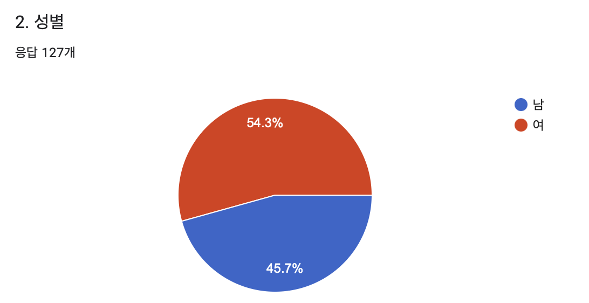
    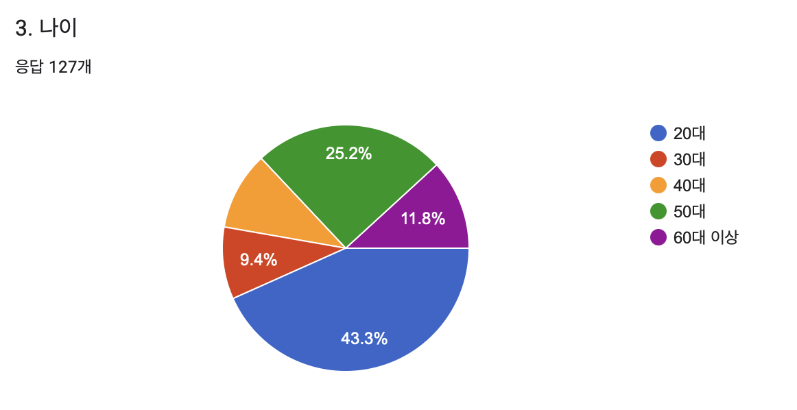
    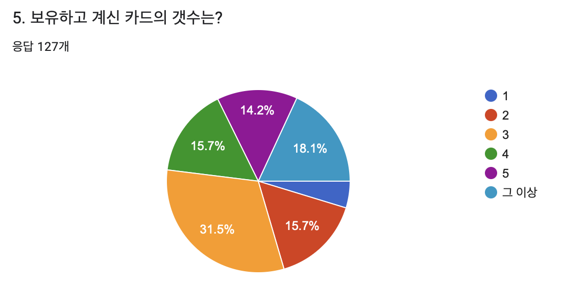
    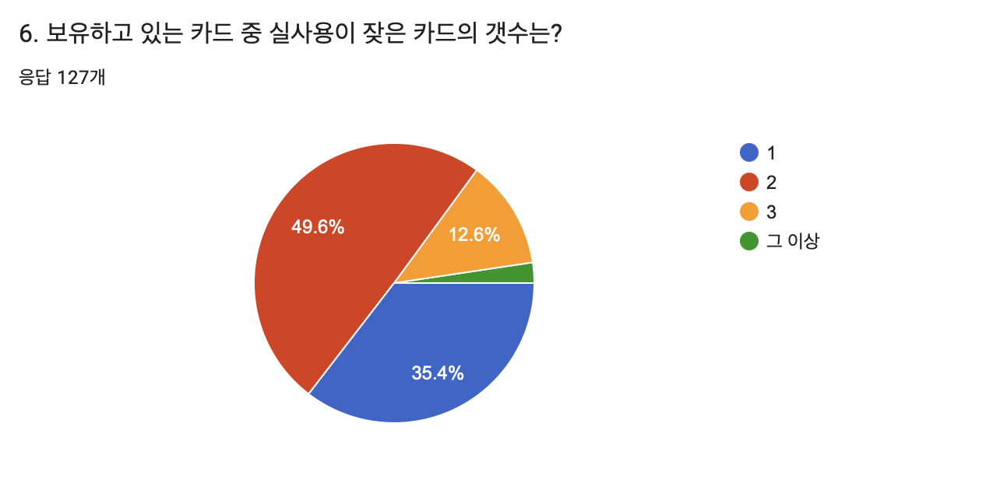
    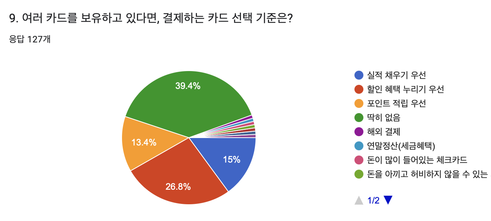
    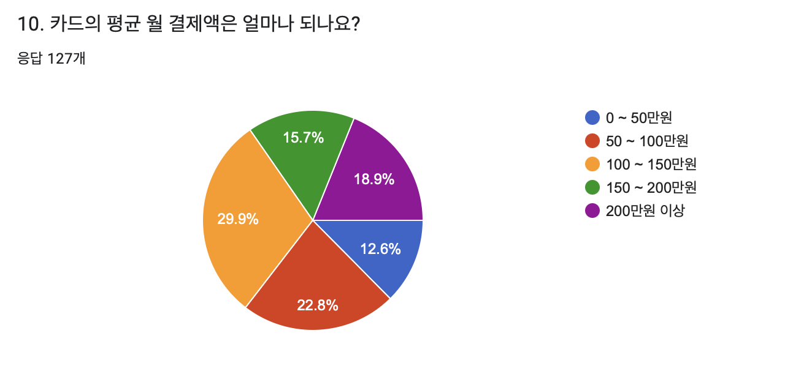
    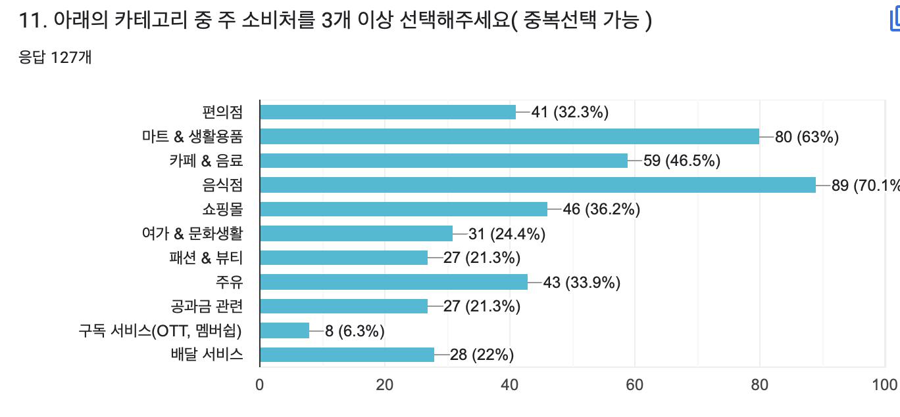
</div>

▪️**서비스 목적**

▪️**서비스 목표**

▪️**기대효과**

## ✅ 기능 소개 

### 로그인, 회원 가입
<table>    
    <tr align="center"> 
        <td><strong> 초기 화면 </strong></td>
        <td><strong> 회원 가입</strong></td>
    </tr>
    <tr align="center"> 
        <td>  </td>
        <td>  </td>
    </tr>
    <tr> 
        <td>
            1. 앱 실행 시 로그인 및 회원가입 진행 가능 <br>
        </td>
        <td>
            1. 이름, 주민 번호, 통신사, 핸드폰 번호 입력<br>
            2. 수신 받은 인증번호를 통해 회원 가입 진행
        </td>
    </tr>
    <tr align="center"> 
        <td><strong>간편 비밀번호</strong></td>
        <td><strong>지문 등록</strong></td>
    </tr>
    <tr align="center"> 
        <td> 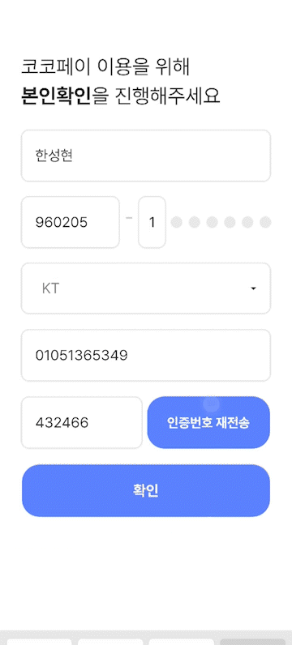 </td>
        <td>  </td>
    </tr>
    <tr> 
        <td >
            1. 간편 비밀번호 등록 가능<br>
            2. 재확인을 통해 오입력, 실수 방지
        </td>
        <td>
            1. 보안성 강화를 위한 지문 등록<br>
            2. 건너뛰기를 통해 지문 인식 넘기기 가능 <br>
            3. 지문 등록 실패 시 재시도 화면을 통해 알림
        </td>
    </tr>
</table>

### 스플래시 화면
<table>    
    <tr align="center" > 
        <td><strong>스플래시</strong></td>
    </tr>
    <tr align="center"> 
        <td>  </td>
    </tr>
    <tr> 
        <td>
            1. 회원 가입 이후 코코페이 간단한 소개 진행
        </td>
</table>

### 카드 불러오기, 추천 타입
<table>    
    <tr align="center" > 
        <td><strong>카드 불러오기</strong></td>
        <td><strong>추천 타입 설정</strong></td>
    </tr>
    <tr align="center"> 
        <td>  </td>
        <td>  </td>
    </tr>
    <tr> 
        <td>
            1. 각 은행에 있는 사용자의 카드를 조회<br>
            2. 카드 정보와 실적 달성률을 그래프로 표현
        </td>
        <td>
            1. 사용자가 원하는 카드 추천 로직 설정<br>
        </td>
</table>

### 메인화면
<table>    
    <tr align="center" > 
        <td><strong>메인 화면</strong></td>
    </tr>
    <tr align="center"> 
        <td>  </td>
    </tr>
    <tr> 
        <td>
            1. 해당 월에 할인, 소비한 금액을 확인 가능<br>
            2. 하단 바코드를 통해 오프라인 결제 가능<br>
            3. 스와이핑을 통해 오프라인 결제 카드 선택 가능
        </td>
</table>


### 온라인 결제
<table>    
    <tr align="center" > 
        <td><strong>바코드 잠금, 지문 인식 설정</strong></td>
        <td><strong>최종 결제</strong></td>
    </tr>
    <tr align="center">
        <td>  </td>
        <td>  </td>
    </tr>
    <tr> 
        <td>
          사용자가 설정한 타입 기반 추천 진행<br>
          1. 결제 QR 인식 시 자동 앱 구동<br>
          2. 결제하기 진행 시 카드 추천<br>
          3. 추천된 카드와 할인율, 남은 실적 확인<br>
          4. 추천 외 다른 카드로 결제 가능
        </td>
        <td>
          1. 결제하기 버튼을 눌러 최종 결제 진행<br>
          2. 신용 카드의 경우 할부 선택 가능<br>
          3. 홈으로 이동 가능
        </td>
</table>
<table>
  <tr align="center">
    <td><strong>결제 준비</strong></td>
    <td><strong>결제 후</strong></td>
  </tr>
  <tr>
    <td></td>
    <td>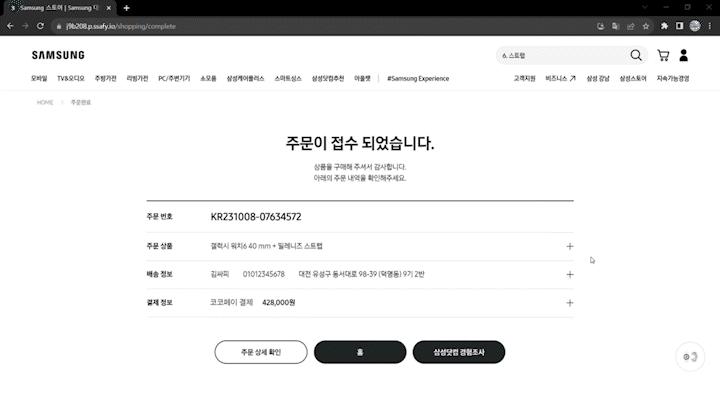</td>
  </tr>
  <tr>
    <td>
      결제 진행을 위한 가상의 홈페이지<br>
      1. 상품 선택 후 하단의 코코페이 버튼 선택<br>
      2. 결제하기 버튼 클릭 시 코코페이 QR 결제 창 오픈
    </td>
    <td>
      1. 앱 결제 완료 시 자동 페이지 전환<br>
    </td> 
  </tr>
</table>

### 오프라인 결제
<table>
  <tr align="center">
    <td><strong>오프라인 결제(할인순)</strong></td>
    <td><strong>오프라인 결제(실적순)</strong></td>
  </tr>
  <tr align="center">
    <td></td>
    <td></td>
  </tr>
  <tr>
    <td>
      사용자가 설정한 타입 기반 추천 진행<br>
      1. 바코드 인식 시 카드 추천 진행 <br>
      2. 추천 후 자동 결제 진행<br>
      3. 결제 카드와 할인 금액, 남은 실적 확인
    </td>
    <td>
      사용자가 설정한 타입 기반 추천 진행<br>
      1. 추천 타입 변경 후 오프라인 결제 진행<br>
      2. 실적순으로 인한 다른 카드로 결제 진행<br>
      3. 결제 카드와 할인 금액, 남은 실적 확인
    </td> 
  </tr>
</table>
<table>
  <tr align="center">
    <td><strong>오프라인 결제(할인순)</strong></td>
    <td><strong>오프라인 결제(실적순)</strong></td>
  </tr>
  <tr align="center">
    <td></td>
    <td></td>
  </tr>
  <tr>
    <td>
      사용자가 설정한 타입 기반 추천 진행<br>
      1. 바코드 인식 시 카드 추천 진행 <br>
      2. 추천 후 자동 결제 진행<br>
      3. 결제 카드와 할인 금액, 남은 실적 확인
    </td>
    <td>
      1. 추천 타입 변경 후 오프라인 결제 진행<br>
      2. 실적순으로 인한 다른 카드로 결제 진행<br>
      3. 결제 카드와 할인 금액, 남은 실적 확인
    </td> 
  </tr>
</table>

### 카드
<table>    
    <tr align="center" > 
        <td><strong>카드 세부 정보 조회</strong></td>
        <td><strong>카드 삭제</strong></td>
    </tr>
    <tr align="center">
        <td>  </td>
        <td> 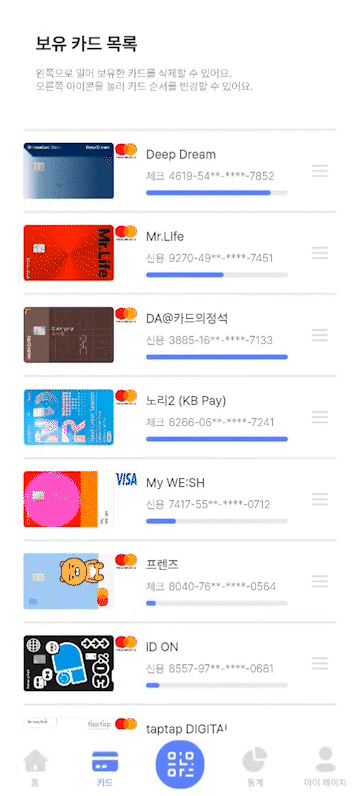 </td>
    </tr>
    <tr> 
        <td>
            1. 카드를 클릭하여 카드 세부 정보 조회<br>
            2. 현재 실적률을 그래프로 확인<br>
            3. 실적 단계 확인<br>
            4. 달력을 통해 월별 이용내역 확인
        </td>
        <td>
            1. 카드를 왼쪽으로 스와이핑하여 카드 삭제 <br>
            2. 실수 방지를 위한 추가 확인 진행
        </td>
    <tr align="center" > 
        <td><strong>카드 세부 정보 조회</strong></td>
        <td><strong>카드 세부 정보 조회</strong></td>
    </tr>
    <tr align="center">
        <td> 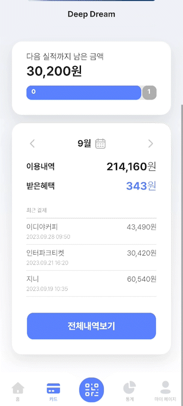 </td>
        <td>  </td>
    </tr>
    <tr> 
        <td>
            1. 월별 카드 명세 확인 가능<br>
            2. 월별 이용내역, 받은 혜택 확인 가능<br>
            2. 전체 내역 확인 가능
        </td>
        <td>
            1. 월별 카드 명세 확인 가능<br>
            2. 월별 이용내역, 받은 혜택 확인 가능<br>
            2. 전체 내역 확인 가능
        </td>
</table>

### 통계
<table>    
    <tr align="center" > 
        <td><strong>이번 달 할인 내역, 이용내역</strong></td>
        <td><strong>내 소비, 혜택</strong></td>
    </tr>
    <tr align="center">
        <td>  </td>
        <td>  </td>
    </tr>
    <tr> 
        <td>
          1. 이번 달에 받은 총 할인 혜택 금액 확인<br>
          2. 이미지를 통해 상위 4개 확인<br>
          3. 그래프를 통해 카테고리별 세부 금액 확인
        </td>
        <td>
            1. 달력을 통해 다른 월 확인<br>
            2. 내 소비, 혜택 전환 
        </td>
</table>

### 마이페이지
<table>    
    <tr align="center" > 
        <td><strong>바코드 잠금, 지문 인식 설정</strong></td>
        <td><strong>추천 타입 변경</strong></td>
        <td><strong>회원 탈퇴</strong></td>
    </tr>
    <tr align="center">
        <td>  </td>
        <td>  </td>
        <td>  </td>
    </tr>
    <tr> 
        <td>
          1. 바코드 잠금 여부 설정<br>
          2. 지문 인식 사용 여부<br>
        </td>
        <td>
          1. 카드 추천 타입 변경<br>
        </td>
        <td>
          1. 회원 탈퇴
        </td>
</table>

## ✅ 활용기술, 기술 설명

- **병렬 스트림 (Parallel Stream)**
    1. 사용자의 카드리스트에 랜덤 바코드를 생성하여 반환하는 과정에서 성능 저하가 발생 → 클라이언트로 반환까지 약 3초 이상
    2. 데이터 가공 로직을 병렬로 처리하여 대기하지 않고 동시에 로직 진행
    3. 데이터들의 대기 시간이 줄어들며 성능 개선

    ```java
    long start = System.currentTimeMillis();
    
            list.parallelStream()
                    .forEach(v -> {
                        String barcodeNum = makeBarcode(userId, v.getId(), faker);
                        v.setBarcodeNum(barcodeNum);
                    });
    
            long end = System.currentTimeMillis() - start;
            log.info("end : {}", end);
    
            return list.stream()
                    .sorted(Comparator.comparing(MainCardDto::getCardOrder))
                    .toList();
    ```
 
  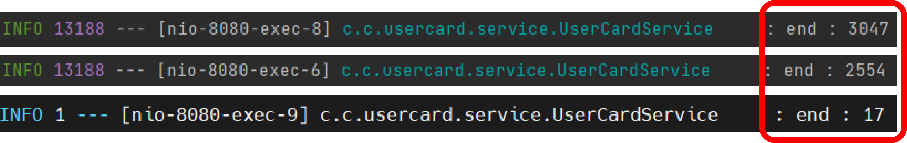

- **아토믹 패턴**
    - UI 컴포넌트를 가장 작은 단위인 Atom(원자) 단위로 쪼개고 합치며 디자인 및 개발하는 패턴
    - 이번 프로젝트의 경우 atom, molecule, organism으로 나누어 진행 함

  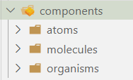

  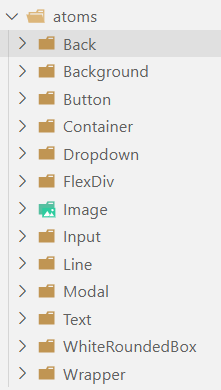

  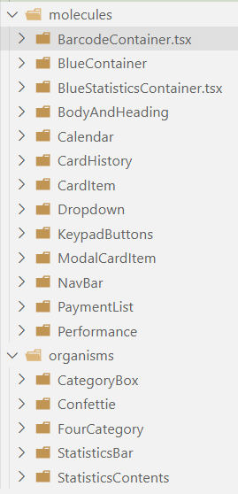

- 생체인증

## ✅ 산출물(ERD, 명세서, 파일구조)

### ERD (bank, cocopay)

<div style="display: flex; justify-content: space-between;">
    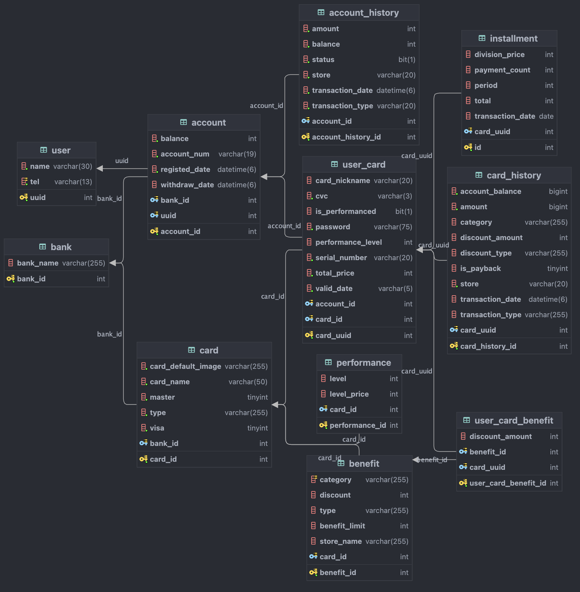
    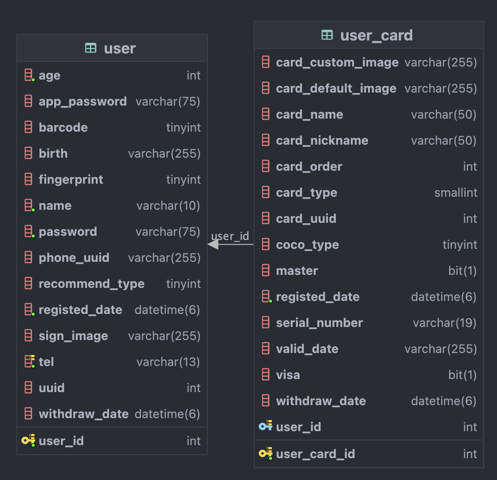
</div>

### 명세서

- **요구사항, 기능 명세서**

  [https://cyan-crabapple-8b0.notion.site/922db08d09724288b2f8ac562a70bd59?pvs=4](https://www.notion.so/922db08d09724288b2f8ac562a70bd59?pvs=21)

- **API 명세서**

  coco
  pay : [https://documenter.getpostman.com/view/23655032/2s9YC8wWWE](https://documenter.getpostman.com/view/23655032/2s9YC8wWWE)

  bank : [https://documenter.getpostman.com/view/23655032/2s9YBxZG3t](https://documenter.getpostman.com/view/23655032/2s9YBxZG3t)

### 파일 구조

<details>
<summary>Bank-Directory</summary>

### bank

    ```
    .
    ├── Dockerfile
    ├── bank_tree.txt
    ├── build
    │   ├── classes
    │   │   └── java
    │   │       ├── main
    │   │       │   └── com
    │   │       │       └── bank
    │   │       │           ├── BankApplication.class
    │   │       │           ├── TestController.class
    │   │       │           ├── account
    │   │       │           │   ├── controller
    │   │       │           │   │   └── AccountController.class
    │   │       │           │   ├── dto
    │   │       │           │   │   ├── AccountFindDto.class
    │   │       │           │   │   ├── AccountRegistDto.class
    │   │       │           │   │   └── AccountResponseDto.class
    │   │       │           │   ├── entity
    │   │       │           │   │   ├── Account$AccountBuilder.class
    │   │       │           │   │   ├── Account.class
    │   │       │           │   │   └── QAccount.class
    │   │       │           │   ├── mapper
    │   │       │           │   │   ├── AccountMapper.class
    │   │       │           │   │   └── AccountMapperImpl.class
    │   │       │           │   ├── repository
    │   │       │           │   │   ├── AccountRepository.class
    │   │       │           │   │   ├── AccountRepositoryCustom.class
    │   │       │           │   │   └── AccountRepositoryImpl.class
    │   │       │           │   └── service
    │   │       │           │       └── AccountService.class
    │   │       │           ├── account_history
    │   │       │           │   ├── controller
    │   │       │           │   │   └── AccountHistoryController.class
    │   │       │           │   ├── dto
    │   │       │           │   │   ├── AccountHistoryFindDto.class
    │   │       │           │   │   ├── AccountHistoryRegistDto.class
    │   │       │           │   │   └── AccountHistoryResponseDto.class
    │   │       │           │   ├── entity
    │   │       │           │   │   ├── AccountHistory$AccountHistoryBuilder.class
    │   │       │           │   │   ├── AccountHistory.class
    │   │       │           │   │   └── QAccountHistory.class
    │   │       │           │   ├── mapper
    │   │       │           │   │   ├── AccountHistoryMapper.class
    │   │       │           │   │   └── AccountHistoryMapperImpl.class
    │   │       │           │   ├── repository
    │   │       │           │   │   ├── AccountHistoryRepository.class
    │   │       │           │   │   ├── AccountHistoryRepositoryCustom.class
    │   │       │           │   │   └── AccountHistoryRepositoryImpl.class
    │   │       │           │   └── service
    │   │       │           │       └── AccountHistoryService.class
    │   │       │           ├── bank
    │   │       │           │   ├── controller
    │   │       │           │   │   └── BankController.class
    │   │       │           │   ├── dto
    │   │       │           │   │   └── BankResponseDto.class
    │   │       │           │   ├── entity
    │   │       │           │   │   ├── Bank.class
    │   │       │           │   │   └── QBank.class
    │   │       │           │   ├── mapper
    │   │       │           │   │   ├── BankMapper.class
    │   │       │           │   │   └── BankMapperImpl.class
    │   │       │           │   ├── repository
    │   │       │           │   │   └── BankRepository.class
    │   │       │           │   └── service
    │   │       │           │       └── BankService.class
    │   │       │           ├── benefit
    │   │       │           │   ├── controller
    │   │       │           │   │   └── BenefitController.class
    │   │       │           │   ├── dto
    │   │       │           │   │   ├── BenefitInfoResponseDto.class
    │   │       │           │   │   ├── BenefitInfoResponseListDto.class
    │   │       │           │   │   ├── BenefitResponseDto.class
    │   │       │           │   │   └── UserCardBenefitInfoDto.class
    │   │       │           │   ├── entity
    │   │       │           │   │   ├── Benefit$BenefitBuilder.class
    │   │       │           │   │   ├── Benefit.class
    │   │       │           │   │   ├── QBenefit.class
    │   │       │           │   │   ├── QUserCardBenefit.class
    │   │       │           │   │   └── UserCardBenefit.class
    │   │       │           │   ├── mapper
    │   │       │           │   │   ├── BenefitMapper.class
    │   │       │           │   │   └── BenefitMapperImpl.class
    │   │       │           │   ├── repository
    │   │       │           │   │   ├── BenefitRepository.class
    │   │       │           │   │   ├── BenefitRepositoryCustom.class
    │   │       │           │   │   ├── BenefitRepositoryImpl.class
    │   │       │           │   │   ├── UserCardBenefitRepository.class
    │   │       │           │   │   ├── UserCardBenefitRepositoryCustom.class
    │   │       │           │   │   └── UserCardBenefitRepositoryImpl.class
    │   │       │           │   └── service
    │   │       │           │       ├── BenefitService.class
    │   │       │           │       └── UserCardBenefitService.class
    │   │       │           ├── card
    │   │       │           │   ├── controller
    │   │       │           │   │   └── CardController.class
    │   │       │           │   ├── dto
    │   │       │           │   │   ├── CardFindDto.class
    │   │       │           │   │   ├── FindBySerialNumber.class
    │   │       │           │   │   ├── PayResponseDto.class
    │   │       │           │   │   ├── PaymentRequestDto$PaymentRequestDtoBuilder.class
    │   │       │           │   │   ├── PaymentRequestDto.class
    │   │       │           │   │   ├── PerformanceResponseDto.class
    │   │       │           │   │   ├── QUserCardResponseDto.class
    │   │       │           │   │   ├── UserCardDto.class
    │   │       │           │   │   ├── UserCardRegisterDto.class
    │   │       │           │   │   ├── UserCardResponseDto.class
    │   │       │           │   │   └── UserCardResponseListDto.class
    │   │       │           │   ├── entity
    │   │       │           │   │   ├── Card.class
    │   │       │           │   │   ├── CardType.class
    │   │       │           │   │   ├── QCard.class
    │   │       │           │   │   ├── QUserCard.class
    │   │       │           │   │   ├── UserCard$UserCardBuilder.class
    │   │       │           │   │   └── UserCard.class
    │   │       │           │   ├── mapper
    │   │       │           │   │   ├── UserCardMapper.class
    │   │       │           │   │   └── UserCardMapperImpl.class
    │   │       │           │   ├── repository
    │   │       │           │   │   ├── card
    │   │       │           │   │   │   ├── CardRepository.class
    │   │       │           │   │   │   └── CardRepositoryCustom.class
    │   │       │           │   │   └── usercard
    │   │       │           │   │       ├── UserCardRepository.class
    │   │       │           │   │       ├── UserCardRepositoryCustom.class
    │   │       │           │   │       └── UserCardRepositoryImpl.class
    │   │       │           │   └── service
    │   │       │           │       ├── PaymentService.class
    │   │       │           │       └── UserCardService.class
    │   │       │           ├── card_history
    │   │       │           │   ├── controller
    │   │       │           │   │   └── CardHistoryController.class
    │   │       │           │   ├── dto
    │   │       │           │   │   ├── CategoryDiscountDto.class
    │   │       │           │   │   ├── CategoryDiscountResponseDto$CategoryDiscountResponseDtoBuilder.class
    │   │       │           │   │   ├── CategoryDiscountResponseDto.class
    │   │       │           │   │   ├── CategoryDto.class
    │   │       │           │   │   ├── CategoryPriceDto.class
    │   │       │           │   │   ├── CategoryPriceResponseDto$CategoryPriceResponseDtoBuilder.class
    │   │       │           │   │   ├── CategoryPriceResponseDto.class
    │   │       │           │   │   ├── CategoryResponseDto$CategoryResponseDtoBuilder.class
    │   │       │           │   │   ├── CategoryResponseDto.class
    │   │       │           │   │   ├── FindHistoryByUserId.class
    │   │       │           │   │   ├── HistoryFindDto.class
    │   │       │           │   │   ├── HistoryResDto.class
    │   │       │           │   │   ├── HistoryResponseDto.class
    │   │       │           │   │   ├── TotalByMonth.class
    │   │       │           │   │   └── TotalByMonthReqDto.class
    │   │       │           │   ├── entity
    │   │       │           │   │   ├── CardHistory$CardHistoryBuilder.class
    │   │       │           │   │   ├── CardHistory.class
    │   │       │           │   │   ├── Category.class
    │   │       │           │   │   ├── DiscountType.class
    │   │       │           │   │   ├── QCardHistory.class
    │   │       │           │   │   └── TransactionType.class
    │   │       │           │   ├── mapper
    │   │       │           │   │   ├── CardHistoryMapper.class
    │   │       │           │   │   └── CardHistoryMapperImpl.class
    │   │       │           │   ├── repository
    │   │       │           │   │   ├── CardHistoryRepository.class
    │   │       │           │   │   ├── CardHistoryRepositoryCustom.class
    │   │       │           │   │   └── CardHistoryRepositoryImpl.class
    │   │       │           │   └── service
    │   │       │           │       └── CardHistoryService.class
    │   │       │           ├── config
    │   │       │           │   ├── AppConfig.class
    │   │       │           │   └── SecurityConfig.class
    │   │       │           ├── exception
    │   │       │           │   ├── controller
    │   │       │           │   │   └── ExceptionController.class
    │   │       │           │   └── dto
    │   │       │           │       ├── CustomException.class
    │   │       │           │       ├── ErrorCode.class
    │   │       │           │       ├── ErrorResponseEntity$ErrorResponseEntityBuilder.class
    │   │       │           │       └── ErrorResponseEntity.class
    │   │       │           ├── installment
    │   │       │           │   ├── controller
    │   │       │           │   │   └── InstallmentController.class
    │   │       │           │   ├── dto
    │   │       │           │   │   ├── InstallmentFindDto.class
    │   │       │           │   │   └── InstallmentRegistDto.class
    │   │       │           │   ├── entity
    │   │       │           │   │   ├── Installment$InstallmentBuilder.class
    │   │       │           │   │   ├── Installment.class
    │   │       │           │   │   └── QInstallment.class
    │   │       │           │   ├── repository
    │   │       │           │   │   ├── InstallmentRepository.class
    │   │       │           │   │   ├── InstallmentRepositoryCustom.class
    │   │       │           │   │   └── InstallmentRepositoryImpl.class
    │   │       │           │   └── service
    │   │       │           │       └── InstallmentService.class
    │   │       │           ├── performance
    │   │       │           │   ├── controller
    │   │       │           │   │   └── PerformanceController.class
    │   │       │           │   ├── dto
    │   │       │           │   │   ├── PerformanceFindDto.class
    │   │       │           │   │   ├── PerformanceRegistDto.class
    │   │       │           │   │   ├── PerformanceResponseDto.class
    │   │       │           │   │   ├── PerformanceResponseListDto.class
    │   │       │           │   │   └── UserCardPerformanceFindDto.class
    │   │       │           │   ├── entity
    │   │       │           │   │   ├── Performance$PerformanceBuilder.class
    │   │       │           │   │   ├── Performance.class
    │   │       │           │   │   └── QPerformance.class
    │   │       │           │   ├── repository
    │   │       │           │   │   ├── PerformanceRepository.class
    │   │       │           │   │   ├── PerformanceRepositoryCustom.class
    │   │       │           │   │   └── PerformanceRepositoryImpl.class
    │   │       │           │   └── service
    │   │       │           │       └── PerformanceService.class
    │   │       │           └── user
    │   │       │               ├── controller
    │   │       │               │   └── UserController.class
    │   │       │               ├── dto
    │   │       │               │   ├── UserFindDto.class
    │   │       │               │   ├── UserRegistDto.class
    │   │       │               │   └── UserResponseDto.class
    │   │       │               ├── entity
    │   │       │               │   ├── QUser.class
    │   │       │               │   ├── User$UserBuilder.class
    │   │       │               │   └── User.class
    │   │       │               ├── mapper
    │   │       │               │   ├── UserMapper.class
    │   │       │               │   └── UserMapperImpl.class
    │   │       │               ├── repository
    │   │       │               │   ├── UserRepository.class
    │   │       │               │   ├── UserRepositoryCustom.class
    │   │       │               │   └── UserRepositoryImpl.class
    │   │       │               └── service
    │   │       │                   └── UserService.class
    │   │       └── test
    │   │           └── com
    │   │               └── bank
    │   │                   ├── BankApplicationTests.class
    │   │                   ├── CardHistoryDummy.class
    │   │                   ├── DockerDbDummyTest.class
    │   │                   ├── DummyDataTest$CardList.class
    │   │                   ├── DummyDataTest.class
    │   │                   └── enumlist
    │   │                       ├── BenefitList.class
    │   │                       ├── CardList.class
    │   │                       └── PerformanceList.class
    │   ├── generated
    │   │   └── sources
    │   │       ├── annotationProcessor
    │   │       │   └── java
    │   │       │       ├── main
    │   │       │       │   └── com
    │   │       │       │       └── bank
    │   │       │       │           ├── account
    │   │       │       │           │   ├── entity
    │   │       │       │           │   │   └── QAccount.java
    │   │       │       │           │   └── mapper
    │   │       │       │           │       └── AccountMapperImpl.java
    │   │       │       │           ├── account_history
    │   │       │       │           │   ├── entity
    │   │       │       │           │   │   └── QAccountHistory.java
    │   │       │       │           │   └── mapper
    │   │       │       │           │       └── AccountHistoryMapperImpl.java
    │   │       │       │           ├── bank
    │   │       │       │           │   ├── entity
    │   │       │       │           │   │   └── QBank.java
    │   │       │       │           │   └── mapper
    │   │       │       │           │       └── BankMapperImpl.java
    │   │       │       │           ├── benefit
    │   │       │       │           │   ├── entity
    │   │       │       │           │   │   ├── QBenefit.java
    │   │       │       │           │   │   └── QUserCardBenefit.java
    │   │       │       │           │   └── mapper
    │   │       │       │           │       └── BenefitMapperImpl.java
    │   │       │       │           ├── card
    │   │       │       │           │   ├── dto
    │   │       │       │           │   │   └── QUserCardResponseDto.java
    │   │       │       │           │   ├── entity
    │   │       │       │           │   │   ├── QCard.java
    │   │       │       │           │   │   └── QUserCard.java
    │   │       │       │           │   └── mapper
    │   │       │       │           │       └── UserCardMapperImpl.java
    │   │       │       │           ├── card_history
    │   │       │       │           │   ├── entity
    │   │       │       │           │   │   └── QCardHistory.java
    │   │       │       │           │   └── mapper
    │   │       │       │           │       └── CardHistoryMapperImpl.java
    │   │       │       │           ├── installment
    │   │       │       │           │   └── entity
    │   │       │       │           │       └── QInstallment.java
    │   │       │       │           ├── performance
    │   │       │       │           │   └── entity
    │   │       │       │           │       └── QPerformance.java
    │   │       │       │           └── user
    │   │       │       │               ├── entity
    │   │       │       │               │   └── QUser.java
    │   │       │       │               └── mapper
    │   │       │       │                   └── UserMapperImpl.java
    │   │       │       └── test
    │   │       └── headers
    │   │           └── java
    │   │               ├── main
    │   │               └── test
    │   ├── resources
    │   │   └── main
    │   │       └── application.yml
    │   └── tmp
    │       ├── compileJava
    │       │   ├── compileTransaction
    │       │   │   ├── backup-dir
    │       │   │   └── stash-dir
    │       │   │       ├── Benefit$BenefitBuilder.class.uniqueId37
    │       │   │       ├── Benefit.class.uniqueId66
    │       │   │       ├── BenefitController.class.uniqueId4
    │       │   │       ├── BenefitMapper.class.uniqueId13
    │       │   │       ├── BenefitMapperImpl.class.uniqueId60
    │       │   │       ├── BenefitMapperImpl.java.uniqueId9
    │       │   │       ├── BenefitRepository.class.uniqueId15
    │       │   │       ├── BenefitRepositoryCustom.class.uniqueId21
    │       │   │       ├── BenefitRepositoryImpl.class.uniqueId14
    │       │   │       ├── BenefitService.class.uniqueId17
    │       │   │       ├── Card.class.uniqueId48
    │       │   │       ├── CardController.class.uniqueId44
    │       │   │       ├── CardHistory$CardHistoryBuilder.class.uniqueId34
    │       │   │       ├── CardHistory.class.uniqueId45
    │       │   │       ├── CardHistoryController.class.uniqueId20
    │       │   │       ├── CardHistoryMapper.class.uniqueId36
    │       │   │       ├── CardHistoryMapperImpl.class.uniqueId6
    │       │   │       ├── CardHistoryMapperImpl.java.uniqueId35
    │       │   │       ├── CardHistoryRepository.class.uniqueId28
    │       │   │       ├── CardHistoryRepositoryImpl.class.uniqueId39
    │       │   │       ├── CardHistoryService.class.uniqueId50
    │       │   │       ├── CardRepository.class.uniqueId58
    │       │   │       ├── Installment$InstallmentBuilder.class.uniqueId42
    │       │   │       ├── Installment.class.uniqueId24
    │       │   │       ├── InstallmentController.class.uniqueId65
    │       │   │       ├── InstallmentRepository.class.uniqueId62
    │       │   │       ├── InstallmentRepositoryCustom.class.uniqueId55
    │       │   │       ├── InstallmentRepositoryImpl.class.uniqueId64
    │       │   │       ├── InstallmentService.class.uniqueId46
    │       │   │       ├── PaymentRequestDto$PaymentRequestDtoBuilder.class.uniqueId19
    │       │   │       ├── PaymentRequestDto.class.uniqueId10
    │       │   │       ├── PaymentService.class.uniqueId49
    │       │   │       ├── Performance$PerformanceBuilder.class.uniqueId27
    │       │   │       ├── Performance.class.uniqueId31
    │       │   │       ├── PerformanceController.class.uniqueId59
    │       │   │       ├── PerformanceRepository.class.uniqueId53
    │       │   │       ├── PerformanceRepositoryCustom.class.uniqueId57
    │       │   │       ├── PerformanceRepositoryImpl.class.uniqueId11
    │       │   │       ├── PerformanceService.class.uniqueId52
    │       │   │       ├── QBenefit.class.uniqueId16
    │       │   │       ├── QBenefit.java.uniqueId26
    │       │   │       ├── QCard.class.uniqueId63
    │       │   │       ├── QCard.java.uniqueId41
    │       │   │       ├── QCardHistory.class.uniqueId12
    │       │   │       ├── QCardHistory.java.uniqueId5
    │       │   │       ├── QInstallment.class.uniqueId40
    │       │   │       ├── QInstallment.java.uniqueId30
    │       │   │       ├── QPerformance.class.uniqueId1
    │       │   │       ├── QPerformance.java.uniqueId33
    │       │   │       ├── QUserCard.class.uniqueId54
    │       │   │       ├── QUserCard.java.uniqueId23
    │       │   │       ├── QUserCardBenefit.class.uniqueId56
    │       │   │       ├── QUserCardBenefit.java.uniqueId51
    │       │   │       ├── UserCard$UserCardBuilder.class.uniqueId0
    │       │   │       ├── UserCard.class.uniqueId7
    │       │   │       ├── UserCardBenefit.class.uniqueId22
    │       │   │       ├── UserCardBenefitRepository.class.uniqueId25
    │       │   │       ├── UserCardBenefitRepositoryCustom.class.uniqueId43
    │       │   │       ├── UserCardBenefitRepositoryImpl.class.uniqueId38
    │       │   │       ├── UserCardBenefitService.class.uniqueId61
    │       │   │       ├── UserCardMapper.class.uniqueId18
    │       │   │       ├── UserCardMapperImpl.class.uniqueId32
    │       │   │       ├── UserCardMapperImpl.java.uniqueId29
    │       │   │       ├── UserCardRepository.class.uniqueId8
    │       │   │       ├── UserCardRepositoryCustom.class.uniqueId3
    │       │   │       ├── UserCardRepositoryImpl.class.uniqueId47
    │       │   │       └── UserCardService.class.uniqueId2
    │       │   └── previous-compilation-data.bin
    │       └── compileTestJava
    │           ├── compileTransaction
    │           │   ├── backup-dir
    │           │   └── stash-dir
    │           │       ├── CardHistoryDummy.class.uniqueId0
    │           │       └── DockerDbDummyTest.class.uniqueId1
    │           └── previous-compilation-data.bin
    ├── build.gradle
    ├── gradle
    │   └── wrapper
    │       ├── gradle-wrapper.jar
    │       └── gradle-wrapper.properties
    ├── gradlew
    ├── gradlew.bat
    ├── settings.gradle
    └── src
        ├── main
        │   ├── java
        │   │   └── com
        │   │       └── bank
        │   │           ├── BankApplication.java
        │   │           ├── TestController.java
        │   │           ├── account
        │   │           │   ├── controller
        │   │           │   │   └── AccountController.java
        │   │           │   ├── dto
        │   │           │   │   ├── AccountFindDto.java
        │   │           │   │   ├── AccountRegistDto.java
        │   │           │   │   └── AccountResponseDto.java
        │   │           │   ├── entity
        │   │           │   │   └── Account.java
        │   │           │   ├── mapper
        │   │           │   │   └── AccountMapper.java
        │   │           │   ├── repository
        │   │           │   │   ├── AccountRepository.java
        │   │           │   │   ├── AccountRepositoryCustom.java
        │   │           │   │   └── AccountRepositoryImpl.java
        │   │           │   └── service
        │   │           │       └── AccountService.java
        │   │           ├── account_history
        │   │           │   ├── controller
        │   │           │   │   └── AccountHistoryController.java
        │   │           │   ├── dto
        │   │           │   │   ├── AccountHistoryFindDto.java
        │   │           │   │   ├── AccountHistoryRegistDto.java
        │   │           │   │   └── AccountHistoryResponseDto.java
        │   │           │   ├── entity
        │   │           │   │   └── AccountHistory.java
        │   │           │   ├── mapper
        │   │           │   │   └── AccountHistoryMapper.java
        │   │           │   ├── repository
        │   │           │   │   ├── AccountHistoryRepository.java
        │   │           │   │   ├── AccountHistoryRepositoryCustom.java
        │   │           │   │   └── AccountHistoryRepositoryImpl.java
        │   │           │   └── service
        │   │           │       └── AccountHistoryService.java
        │   │           ├── bank
        │   │           │   ├── controller
        │   │           │   │   └── BankController.java
        │   │           │   ├── dto
        │   │           │   │   └── BankResponseDto.java
        │   │           │   ├── entity
        │   │           │   │   └── Bank.java
        │   │           │   ├── mapper
        │   │           │   │   └── BankMapper.java
        │   │           │   ├── repository
        │   │           │   │   └── BankRepository.java
        │   │           │   └── service
        │   │           │       └── BankService.java
        │   │           ├── benefit
        │   │           │   ├── controller
        │   │           │   │   └── BenefitController.java
        │   │           │   ├── dto
        │   │           │   │   ├── BenefitInfoResponseDto.java
        │   │           │   │   ├── BenefitInfoResponseListDto.java
        │   │           │   │   ├── BenefitResponseDto.java
        │   │           │   │   └── UserCardBenefitInfoDto.java
        │   │           │   ├── entity
        │   │           │   │   ├── Benefit.java
        │   │           │   │   └── UserCardBenefit.java
        │   │           │   ├── mapper
        │   │           │   │   └── BenefitMapper.java
        │   │           │   ├── repository
        │   │           │   │   ├── BenefitRepository.java
        │   │           │   │   ├── BenefitRepositoryCustom.java
        │   │           │   │   ├── BenefitRepositoryImpl.java
        │   │           │   │   ├── UserCardBenefitRepository.java
        │   │           │   │   ├── UserCardBenefitRepositoryCustom.java
        │   │           │   │   └── UserCardBenefitRepositoryImpl.java
        │   │           │   └── service
        │   │           │       ├── BenefitService.java
        │   │           │       └── UserCardBenefitService.java
        │   │           ├── card
        │   │           │   ├── controller
        │   │           │   │   └── CardController.java
        │   │           │   ├── dto
        │   │           │   │   ├── CardFindDto.java
        │   │           │   │   ├── FindBySerialNumber.java
        │   │           │   │   ├── PayResponseDto.java
        │   │           │   │   ├── PaymentRequestDto.java
        │   │           │   │   ├── PerformanceResponseDto.java
        │   │           │   │   ├── UserCardDto.java
        │   │           │   │   ├── UserCardRegisterDto.java
        │   │           │   │   ├── UserCardResponseDto.java
        │   │           │   │   └── UserCardResponseListDto.java
        │   │           │   ├── entity
        │   │           │   │   ├── Card.java
        │   │           │   │   ├── CardType.java
        │   │           │   │   └── UserCard.java
        │   │           │   ├── mapper
        │   │           │   │   └── UserCardMapper.java
        │   │           │   ├── repository
        │   │           │   │   ├── card
        │   │           │   │   │   ├── CardRepository.java
        │   │           │   │   │   └── CardRepositoryCustom.java
        │   │           │   │   └── usercard
        │   │           │   │       ├── UserCardRepository.java
        │   │           │   │       ├── UserCardRepositoryCustom.java
        │   │           │   │       └── UserCardRepositoryImpl.java
        │   │           │   └── service
        │   │           │       ├── PaymentService.java
        │   │           │       └── UserCardService.java
        │   │           ├── card_history
        │   │           │   ├── controller
        │   │           │   │   └── CardHistoryController.java
        │   │           │   ├── dto
        │   │           │   │   ├── CategoryDiscountDto.java
        │   │           │   │   ├── CategoryDiscountResponseDto.java
        │   │           │   │   ├── CategoryDto.java
        │   │           │   │   ├── CategoryPriceDto.java
        │   │           │   │   ├── CategoryPriceResponseDto.java
        │   │           │   │   ├── CategoryResponseDto.java
        │   │           │   │   ├── FindHistoryByUserId.java
        │   │           │   │   ├── HistoryFindDto.java
        │   │           │   │   ├── HistoryResDto.java
        │   │           │   │   ├── HistoryResponseDto.java
        │   │           │   │   ├── TotalByMonth.java
        │   │           │   │   └── TotalByMonthReqDto.java
        │   │           │   ├── entity
        │   │           │   │   ├── CardHistory.java
        │   │           │   │   ├── Category.java
        │   │           │   │   ├── DiscountType.java
        │   │           │   │   └── TransactionType.java
        │   │           │   ├── mapper
        │   │           │   │   └── CardHistoryMapper.java
        │   │           │   ├── repository
        │   │           │   │   ├── CardHistoryRepository.java
        │   │           │   │   ├── CardHistoryRepositoryCustom.java
        │   │           │   │   └── CardHistoryRepositoryImpl.java
        │   │           │   └── service
        │   │           │       └── CardHistoryService.java
        │   │           ├── config
        │   │           │   ├── AppConfig.java
        │   │           │   └── SecurityConfig.java
        │   │           ├── exception
        │   │           │   ├── controller
        │   │           │   │   └── ExceptionController.java
        │   │           │   └── dto
        │   │           │       ├── CustomException.java
        │   │           │       ├── ErrorCode.java
        │   │           │       └── ErrorResponseEntity.java
        │   │           ├── installment
        │   │           │   ├── controller
        │   │           │   │   └── InstallmentController.java
        │   │           │   ├── dto
        │   │           │   │   ├── InstallmentFindDto.java
        │   │           │   │   └── InstallmentRegistDto.java
        │   │           │   ├── entity
        │   │           │   │   └── Installment.java
        │   │           │   ├── repository
        │   │           │   │   ├── InstallmentRepository.java
        │   │           │   │   ├── InstallmentRepositoryCustom.java
        │   │           │   │   └── InstallmentRepositoryImpl.java
        │   │           │   └── service
        │   │           │       └── InstallmentService.java
        │   │           ├── performance
        │   │           │   ├── controller
        │   │           │   │   └── PerformanceController.java
        │   │           │   ├── dto
        │   │           │   │   ├── PerformanceFindDto.java
        │   │           │   │   ├── PerformanceRegistDto.java
        │   │           │   │   ├── PerformanceResponseDto.java
        │   │           │   │   ├── PerformanceResponseListDto.java
        │   │           │   │   └── UserCardPerformanceFindDto.java
        │   │           │   ├── entity
        │   │           │   │   └── Performance.java
        │   │           │   ├── repository
        │   │           │   │   ├── PerformanceRepository.java
        │   │           │   │   ├── PerformanceRepositoryCustom.java
        │   │           │   │   └── PerformanceRepositoryImpl.java
        │   │           │   └── service
        │   │           │       └── PerformanceService.java
        │   │           └── user
        │   │               ├── controller
        │   │               │   └── UserController.java
        │   │               ├── dto
        │   │               │   ├── UserFindDto.java
        │   │               │   ├── UserRegistDto.java
        │   │               │   └── UserResponseDto.java
        │   │               ├── entity
        │   │               │   └── User.java
        │   │               ├── mapper
        │   │               │   └── UserMapper.java
        │   │               ├── repository
        │   │               │   ├── UserRepository.java
        │   │               │   ├── UserRepositoryCustom.java
        │   │               │   └── UserRepositoryImpl.java
        │   │               └── service
        │   │                   └── UserService.java
        │   └── resources
        │       └── application.yml
        └── test
            └── java
                └── com
                    └── bank
                        ├── BankApplicationTests.java
                        ├── CardHistoryDummy.java
                        ├── DockerDbDummyTest.java
                        ├── DummyDataTest.java
                        ├── UserCardBenefitDummy.java
                        └── enumlist
                            ├── BenefitList.java
                            ├── CardList.java
                            └── PerformanceList.java
    
    207 directories, 392 files
    ```
</details>

<details>
<summary>Back-Directory</summary>


### Back

    ```
    .
    ├── Dockerfile
    ├── back_tree.txt
    ├── build
    │   ├── classes
    │   │   └── java
    │   │       └── main
    │   │           └── com
    │   │               └── cocopay
    │   │                   ├── CocopayApplication.class
    │   │                   ├── TestController.class
    │   │                   ├── config
    │   │                   │   ├── AppConfig.class
    │   │                   │   ├── RedisConfig.class
    │   │                   │   └── SecurityConfig.class
    │   │                   ├── exception
    │   │                   │   ├── controller
    │   │                   │   │   └── ExceptionController.class
    │   │                   │   └── dto
    │   │                   │       ├── CustomException.class
    │   │                   │       ├── ErrorCode.class
    │   │                   │       ├── ErrorResponseEntity$ErrorResponseEntityBuilder.class
    │   │                   │       └── ErrorResponseEntity.class
    │   │                   ├── payment
    │   │                   │   ├── apicall
    │   │                   │   │   ├── ApiCallService.class
    │   │                   │   │   └── dto
    │   │                   │   │       ├── req
    │   │                   │   │       │   ├── BenefitResDtoList.class
    │   │                   │   │       │   ├── PaymentReqDto.class
    │   │                   │   │       │   ├── UserCardBenefitBodyDto$UserCardBenefitBodyDtoBuilder.class
    │   │                   │   │       │   └── UserCardBenefitBodyDto.class
    │   │                   │   │       └── res
    │   │                   │   │           └── BenefitResDto.class
    │   │                   │   ├── controller
    │   │                   │   │   └── PaymentController.class
    │   │                   │   ├── dto
    │   │                   │   │   ├── req
    │   │                   │   │   │   ├── CardUuidListDto$CardUuidListDtoBuilder.class
    │   │                   │   │   │   ├── CardUuidListDto.class
    │   │                   │   │   │   ├── PayPostDto$PayPostDtoBuilder.class
    │   │                   │   │   │   └── PayPostDto.class
    │   │                   │   │   └── res
    │   │                   │   │       ├── CardOfferResDto.class
    │   │                   │   │       ├── OnlineResponse.class
    │   │                   │   │       ├── PayCompleteResDto.class
    │   │                   │   │       ├── PerformanceResDto.class
    │   │                   │   │       └── PerformanceResListDto.class
    │   │                   │   ├── mapper
    │   │                   │   │   ├── PaymentMapper.class
    │   │                   │   │   └── PaymentMapperImpl.class
    │   │                   │   └── service
    │   │                   │       └── PaymentService.class
    │   │                   ├── redis
    │   │                   │   ├── key
    │   │                   │   │   ├── AuthHash.class
    │   │                   │   │   ├── BarcodeKey.class
    │   │                   │   │   ├── BenefitKey$BenefitKeyBuilder.class
    │   │                   │   │   ├── BenefitKey.class
    │   │                   │   │   ├── FCMHash.class
    │   │                   │   │   ├── OrderKey.class
    │   │                   │   │   ├── PayCompleteKey.class
    │   │                   │   │   └── PerformanceKey.class
    │   │                   │   ├── mapper
    │   │                   │   │   ├── RedisMapper.class
    │   │                   │   │   └── RedisMapperImpl.class
    │   │                   │   ├── repository
    │   │                   │   │   ├── AuthHashRepository.class
    │   │                   │   │   ├── BarcodeKeyRepository.class
    │   │                   │   │   ├── BenefitKeyRepository.class
    │   │                   │   │   ├── FcmKeyRepository.class
    │   │                   │   │   ├── OrderKeyRepository.class
    │   │                   │   │   ├── PayCompleteKeyRepository.class
    │   │                   │   │   └── PerformanceKeyRepository.class
    │   │                   │   └── service
    │   │                   │       ├── AuthKeyService.class
    │   │                   │       ├── BarcodeKeyService.class
    │   │                   │       ├── BenefitKeyService.class
    │   │                   │       ├── FcmKeyService.class
    │   │                   │       ├── OrderKeyService.class
    │   │                   │       ├── PayCompleteKeyService.class
    │   │                   │       └── PerformanceKeyService.class
    │   │                   ├── user
    │   │                   │   ├── controller
    │   │                   │   │   └── UserController.class
    │   │                   │   ├── dto
    │   │                   │   │   ├── request
    │   │                   │   │   │   ├── AuthCheckDto.class
    │   │                   │   │   │   ├── AuthRequestDto.class
    │   │                   │   │   │   ├── CheckPasswordDto.class
    │   │                   │   │   │   ├── LoginRequestDto.class
    │   │                   │   │   │   ├── PasswordUpdateDto.class
    │   │                   │   │   │   ├── TotalByMonthReqDto$TotalByMonthReqDtoBuilder.class
    │   │                   │   │   │   ├── TotalByMonthReqDto.class
    │   │                   │   │   │   ├── UserFindRequestDto.class
    │   │                   │   │   │   ├── UserJoinDto.class
    │   │                   │   │   │   └── UserUpdateDto.class
    │   │                   │   │   └── response
    │   │                   │   │       ├── AuthInformation.class
    │   │                   │   │       ├── TotalByMonth.class
    │   │                   │   │       ├── UserCardResponseListDto.class
    │   │                   │   │       ├── UserFindResponseDto.class
    │   │                   │   │       └── UserJoinResDto.class
    │   │                   │   ├── entity
    │   │                   │   │   ├── QUser.class
    │   │                   │   │   ├── User$UserBuilder.class
    │   │                   │   │   └── User.class
    │   │                   │   ├── mapper
    │   │                   │   │   ├── UserMapper.class
    │   │                   │   │   └── UserMapperImpl.class
    │   │                   │   ├── repository
    │   │                   │   │   ├── UserRepository.class
    │   │                   │   │   ├── UserRepositoryCustom.class
    │   │                   │   │   └── UserRepositoryImpl.class
    │   │                   │   └── service
    │   │                   │       ├── UserApiCallService.class
    │   │                   │       └── UserService.class
    │   │                   ├── usercard
    │   │                   │   ├── controller
    │   │                   │   │   └── UserCardController.class
    │   │                   │   ├── dto
    │   │                   │   │   ├── BarcodeNumResDto.class
    │   │                   │   │   ├── CardListDto$CardListDtoBuilder.class
    │   │                   │   │   ├── CardListDto.class
    │   │                   │   │   ├── CategoryDiscountDto.class
    │   │                   │   │   ├── CategoryDiscountResponseDto$CategoryDiscountResponseDtoBuilder.class
    │   │                   │   │   ├── CategoryDiscountResponseDto.class
    │   │                   │   │   ├── CategoryDto.class
    │   │                   │   │   ├── CategoryPriceDto.class
    │   │                   │   │   ├── CategoryPriceResponseDto$CategoryPriceResponseDtoBuilder.class
    │   │                   │   │   ├── CategoryPriceResponseDto.class
    │   │                   │   │   ├── CategoryResponseDto$CategoryResponseDtoBuilder.class
    │   │                   │   │   ├── CategoryResponseDto.class
    │   │                   │   │   ├── FindHistoryByUserId.class
    │   │                   │   │   ├── HistoryFindDto.class
    │   │                   │   │   ├── HistoryFindReqDto.class
    │   │                   │   │   ├── HistoryResDto$HistoryResDtoBuilder.class
    │   │                   │   │   ├── HistoryResDto.class
    │   │                   │   │   ├── HistoryResDtoTemp.class
    │   │                   │   │   ├── HistoryResListDto.class
    │   │                   │   │   ├── HistoryResponseDto.class
    │   │                   │   │   ├── MainAmountDto$MainAmountDtoBuilder.class
    │   │                   │   │   ├── MainAmountDto.class
    │   │                   │   │   ├── MainCardDto$MainCardDtoBuilder.class
    │   │                   │   │   ├── MainCardDto.class
    │   │                   │   │   ├── UserCardDetailResponseDto$UserCardDetailResponseDtoBuilder.class
    │   │                   │   │   ├── UserCardDetailResponseDto.class
    │   │                   │   │   ├── UserCardDto.class
    │   │                   │   │   ├── UserCardRegistResDto.class
    │   │                   │   │   ├── UserCardRegisterDto.class
    │   │                   │   │   └── UserCardResDto.class
    │   │                   │   ├── entity
    │   │                   │   │   ├── CardType.class
    │   │                   │   │   ├── Category.class
    │   │                   │   │   ├── DiscountType.class
    │   │                   │   │   ├── QUserCard.class
    │   │                   │   │   ├── TransactionType.class
    │   │                   │   │   ├── UserCard$UserCardBuilder.class
    │   │                   │   │   └── UserCard.class
    │   │                   │   ├── mapper
    │   │                   │   │   ├── UserCardMapper.class
    │   │                   │   │   └── UserCardMapperImpl.class
    │   │                   │   ├── repository
    │   │                   │   │   ├── UserCardRepository.class
    │   │                   │   │   ├── UserCardRepositoryCustom.class
    │   │                   │   │   └── UserCardRepositoryImpl.class
    │   │                   │   └── service
    │   │                   │       └── UserCardService.class
    │   │                   └── util
    │   │                       ├── fcm
    │   │                       │   ├── controller
    │   │                       │   │   └── FCMController.class
    │   │                       │   ├── dto
    │   │                       │   │   ├── FCMMessageDto$Data$DataBuilder.class
    │   │                       │   │   ├── FCMMessageDto$Data.class
    │   │                       │   │   ├── FCMMessageDto$FCMMessageDtoBuilder.class
    │   │                       │   │   ├── FCMMessageDto$Message$MessageBuilder.class
    │   │                       │   │   ├── FCMMessageDto$Message.class
    │   │                       │   │   ├── FCMMessageDto$Notification$NotificationBuilder.class
    │   │                       │   │   ├── FCMMessageDto$Notification.class
    │   │                       │   │   └── FCMMessageDto.class
    │   │                       │   └── service
    │   │                       │       └── FcmService.class
    │   │                       └── sens
    │   │                           └── Naver_Sens_V2.class
    │   ├── generated
    │   │   └── sources
    │   │       ├── annotationProcessor
    │   │       │   └── java
    │   │       │       └── main
    │   │       │           └── com
    │   │       │               └── cocopay
    │   │       │                   ├── payment
    │   │       │                   │   └── mapper
    │   │       │                   │       └── PaymentMapperImpl.java
    │   │       │                   ├── redis
    │   │       │                   │   └── mapper
    │   │       │                   │       └── RedisMapperImpl.java
    │   │       │                   ├── user
    │   │       │                   │   ├── entity
    │   │       │                   │   │   └── QUser.java
    │   │       │                   │   └── mapper
    │   │       │                   │       └── UserMapperImpl.java
    │   │       │                   └── usercard
    │   │       │                       ├── entity
    │   │       │                       │   └── QUserCard.java
    │   │       │                       └── mapper
    │   │       │                           └── UserCardMapperImpl.java
    │   │       └── headers
    │   │           └── java
    │   │               └── main
    │   ├── resources
    │   │   └── main
    │   │       ├── application.yml
    │   │       ├── google-services.json
    │   │       └── ssuk-ssuk-push-server-firebase-adminsdk-cue54-4b189a9f26.json
    │   └── tmp
    │       └── compileJava
    │           ├── compileTransaction
    │           │   ├── backup-dir
    │           │   └── stash-dir
    │           │       ├── FCMController.class.uniqueId0
    │           │       └── FcmService.class.uniqueId1
    │           └── previous-compilation-data.bin
    ├── build.gradle
    ├── gradle
    │   └── wrapper
    │       ├── gradle-wrapper.jar
    │       └── gradle-wrapper.properties
    ├── gradlew
    ├── gradlew.bat
    ├── settings.gradle
    └── src
        ├── main
        │   ├── java
        │   │   └── com
        │   │       └── cocopay
        │   │           ├── CocopayApplication.java
        │   │           ├── TestController.java
        │   │           ├── config
        │   │           │   ├── AppConfig.java
        │   │           │   ├── RedisConfig.java
        │   │           │   └── SecurityConfig.java
        │   │           ├── exception
        │   │           │   ├── controller
        │   │           │   │   └── ExceptionController.java
        │   │           │   └── dto
        │   │           │       ├── CustomException.java
        │   │           │       ├── ErrorCode.java
        │   │           │       └── ErrorResponseEntity.java
        │   │           ├── payment
        │   │           │   ├── apicall
        │   │           │   │   ├── ApiCallService.java
        │   │           │   │   └── dto
        │   │           │   │       ├── req
        │   │           │   │       │   ├── BenefitResDtoList.java
        │   │           │   │       │   ├── PaymentReqDto.java
        │   │           │   │       │   └── UserCardBenefitBodyDto.java
        │   │           │   │       └── res
        │   │           │   │           └── BenefitResDto.java
        │   │           │   ├── controller
        │   │           │   │   └── PaymentController.java
        │   │           │   ├── dto
        │   │           │   │   ├── req
        │   │           │   │   │   ├── CardUuidListDto.java
        │   │           │   │   │   └── PayPostDto.java
        │   │           │   │   └── res
        │   │           │   │       ├── CardOfferResDto.java
        │   │           │   │       ├── OnlineResponse.java
        │   │           │   │       ├── PayCompleteResDto.java
        │   │           │   │       ├── PerformanceResDto.java
        │   │           │   │       └── PerformanceResListDto.java
        │   │           │   ├── mapper
        │   │           │   │   └── PaymentMapper.java
        │   │           │   └── service
        │   │           │       └── PaymentService.java
        │   │           ├── redis
        │   │           │   ├── key
        │   │           │   │   ├── AuthHash.java
        │   │           │   │   ├── BarcodeKey.java
        │   │           │   │   ├── BenefitKey.java
        │   │           │   │   ├── CheckKey.java
        │   │           │   │   ├── FCMHash.java
        │   │           │   │   ├── OrderKey.java
        │   │           │   │   ├── PayCompleteKey.java
        │   │           │   │   └── PerformanceKey.java
        │   │           │   ├── mapper
        │   │           │   │   └── RedisMapper.java
        │   │           │   ├── repository
        │   │           │   │   ├── AuthHashRepository.java
        │   │           │   │   ├── BarcodeKeyRepository.java
        │   │           │   │   ├── BenefitKeyRepository.java
        │   │           │   │   ├── CheckKeyRepository.java
        │   │           │   │   ├── FcmKeyRepository.java
        │   │           │   │   ├── OrderKeyRepository.java
        │   │           │   │   ├── PayCompleteKeyRepository.java
        │   │           │   │   └── PerformanceKeyRepository.java
        │   │           │   └── service
        │   │           │       ├── AuthKeyService.java
        │   │           │       ├── BarcodeKeyService.java
        │   │           │       ├── BenefitKeyService.java
        │   │           │       ├── CheckKeyService.java
        │   │           │       ├── FcmKeyService.java
        │   │           │       ├── OrderKeyService.java
        │   │           │       ├── PayCompleteKeyService.java
        │   │           │       └── PerformanceKeyService.java
        │   │           ├── user
        │   │           │   ├── controller
        │   │           │   │   └── UserController.java
        │   │           │   ├── dto
        │   │           │   │   ├── request
        │   │           │   │   │   ├── AuthCheckDto.java
        │   │           │   │   │   ├── AuthRequestDto.java
        │   │           │   │   │   ├── CheckPasswordDto.java
        │   │           │   │   │   ├── LoginRequestDto.java
        │   │           │   │   │   ├── PasswordUpdateDto.java
        │   │           │   │   │   ├── TotalByMonthReqDto.java
        │   │           │   │   │   ├── UserFindRequestDto.java
        │   │           │   │   │   ├── UserJoinDto.java
        │   │           │   │   │   └── UserUpdateDto.java
        │   │           │   │   └── response
        │   │           │   │       ├── AuthInformation.java
        │   │           │   │       ├── TotalByMonth.java
        │   │           │   │       ├── UserCardResponseListDto.java
        │   │           │   │       ├── UserFindResponseDto.java
        │   │           │   │       └── UserJoinResDto.java
        │   │           │   ├── entity
        │   │           │   │   └── User.java
        │   │           │   ├── mapper
        │   │           │   │   └── UserMapper.java
        │   │           │   ├── repository
        │   │           │   │   ├── UserRepository.java
        │   │           │   │   ├── UserRepositoryCustom.java
        │   │           │   │   └── UserRepositoryImpl.java
        │   │           │   └── service
        │   │           │       ├── UserApiCallService.java
        │   │           │       └── UserService.java
        │   │           ├── usercard
        │   │           │   ├── controller
        │   │           │   │   └── UserCardController.java
        │   │           │   ├── dto
        │   │           │   │   ├── BarcodeNumResDto.java
        │   │           │   │   ├── CardListDto.java
        │   │           │   │   ├── CategoryDiscountDto.java
        │   │           │   │   ├── CategoryDiscountResponseDto.java
        │   │           │   │   ├── CategoryDto.java
        │   │           │   │   ├── CategoryPriceDto.java
        │   │           │   │   ├── CategoryPriceResponseDto.java
        │   │           │   │   ├── CategoryResponseDto.java
        │   │           │   │   ├── FindHistoryByUserId.java
        │   │           │   │   ├── HistoryFindDto.java
        │   │           │   │   ├── HistoryFindReqDto.java
        │   │           │   │   ├── HistoryResDto.java
        │   │           │   │   ├── HistoryResDtoTemp.java
        │   │           │   │   ├── HistoryResListDto.java
        │   │           │   │   ├── HistoryResponseDto.java
        │   │           │   │   ├── MainAmountDto.java
        │   │           │   │   ├── MainCardDto.java
        │   │           │   │   ├── UserCardDetailResponseDto.java
        │   │           │   │   ├── UserCardDto.java
        │   │           │   │   ├── UserCardRegistResDto.java
        │   │           │   │   ├── UserCardRegisterDto.java
        │   │           │   │   └── UserCardResDto.java
        │   │           │   ├── entity
        │   │           │   │   ├── CardType.java
        │   │           │   │   ├── Category.java
        │   │           │   │   ├── DiscountType.java
        │   │           │   │   ├── TransactionType.java
        │   │           │   │   └── UserCard.java
        │   │           │   ├── mapper
        │   │           │   │   └── UserCardMapper.java
        │   │           │   ├── repository
        │   │           │   │   ├── UserCardRepository.java
        │   │           │   │   ├── UserCardRepositoryCustom.java
        │   │           │   │   └── UserCardRepositoryImpl.java
        │   │           │   └── service
        │   │           │       └── UserCardService.java
        │   │           └── util
        │   │               ├── fcm
        │   │               │   ├── controller
        │   │               │   │   └── FCMController.java
        │   │               │   ├── dto
        │   │               │   │   └── FCMMessageDto.java
        │   │               │   └── service
        │   │               │       └── FcmService.java
        │   │               └── sens
        │   │                   └── Naver_Sens_V2.java
        │   └── resources
        │       ├── application.yml
        │       ├── google-services.json
        │       └── ssuk-ssuk-push-server-firebase-adminsdk-cue54-4b189a9f26.json
        └── test
            └── java
                └── com
                    └── cocopay
                        ├── CocopayApplicationTests.java
                        └── DummyTest.java
    
    130 directories, 267 files
    ```
</details>

<details>
<summary>Front-Directory</summary>

### front

    ```
    .
    ├── App.css
    ├── App.test.tsx
    ├── App.tsx
    ├── apis
    │   ├── Card
    │   │   ├── Mutations
    │   │   │   ├── useAddCardList.ts
    │   │   │   ├── useDeleteCard.ts
    │   │   │   └── useUpdateCard.ts
    │   │   ├── Queries
    │   │   │   ├── useGetCard.ts
    │   │   │   ├── useGetCardDetails.ts
    │   │   │   └── useGetMainCards.ts
    │   │   └── cardAPI.ts
    │   ├── Purchase
    │   │   ├── Queries
    │   │   │   └── useGetIsPurchased.ts
    │   │   └── purchaseAPI.ts
    │   ├── Statistics
    │   │   ├── Queries
    │   │   │   ├── useGetStatisticConsume.tsx
    │   │   │   └── useGetStatisticDiscount.tsx
    │   │   └── StatisticsAPI.ts
    │   ├── User
    │   │   ├── Mutations
    │   │   │   ├── useAddMessage.tsx
    │   │   │   ├── useAddMessageConfirm.tsx
    │   │   │   ├── useAddPriority.tsx
    │   │   │   ├── useAddUser.tsx
    │   │   │   └── useDeleteUser.tsx
    │   │   ├── Queries
    │   │   │   ├── useGetMyPage.tsx
    │   │   │   └── useGetOfflinePay.tsx
    │   │   └── userAPI.ts
    │   └── instance.ts
    ├── assets
    │   ├── fonts
    │   │   ├── Pretendard-Black.ttf
    │   │   ├── Pretendard-Bold.ttf
    │   │   ├── Pretendard-ExtraBold.ttf
    │   │   ├── Pretendard-ExtraLight.ttf
    │   │   ├── Pretendard-Light.ttf
    │   │   ├── Pretendard-Medium.ttf
    │   │   ├── Pretendard-Regular.ttf
    │   │   ├── Pretendard-SemiBold.ttf
    │   │   └── Pretendard-Thin.ttf
    │   └── images
    │       ├── COCO.png
    │       ├── bg-onboarding-1.png
    │       ├── bg-onboarding4-2.png
    │       ├── bg-onboarding4.png
    │       ├── bg-onboarding5-2.png
    │       ├── bg-onboarding5.png
    │       ├── favicon.ico.png
    │       ├── icon-approved-black.png
    │       ├── icon-approved-grey.png
    │       ├── icon-arrow-left-black.png
    │       ├── icon-arrow-left-grey.png
    │       ├── icon-calendar.png
    │       ├── icon-cardinfo.png
    │       ├── icon-chevron-left-grey.png
    │       ├── icon-chevron-right-grey.png
    │       ├── icon-circle-cafe.png
    │       ├── icon-circle-convenient.png
    │       ├── icon-circle-culture.png
    │       ├── icon-circle-delivery.png
    │       ├── icon-circle-etc.png
    │       ├── icon-circle-flight.png
    │       ├── icon-circle-food.png
    │       ├── icon-circle-mart.png
    │       ├── icon-circle-movie.png
    │       ├── icon-circle-oil.png
    │       ├── icon-circle-onlineShopping.png
    │       ├── icon-circle-transport.png
    │       ├── icon-dot-gray.png
    │       ├── icon-dots-vertical-black.png
    │       ├── icon-hamburger-grey.png
    │       ├── icon-plus-grey.png
    │       ├── icon-qrcode.png
    │       ├── icon-refresh-grey.png
    │       ├── icon-search-blue.png
    │       ├── icon-toggle.png
    │       ├── img-another-card.png
    │       ├── img-arm-left.png
    │       ├── img-arm-right.png
    │       ├── img-card-coco.png
    │       ├── img-card1.png
    │       ├── img-card2.png
    │       ├── img-card3.png
    │       ├── img-cardimg.png
    │       ├── img-cardimg1.png
    │       ├── img-cardimg2.png
    │       ├── img-cardimg3.png
    │       ├── img-cardline.png
    │       ├── img-cardsAnimation.png
    │       ├── img-category-cafe.png
    │       ├── img-category-convenient.png
    │       ├── img-category-culture.png
    │       ├── img-category-delivery.png
    │       ├── img-category-flight.png
    │       ├── img-category-food.png
    │       ├── img-category-mart.png
    │       ├── img-category-movie.png
    │       ├── img-category-oil.png
    │       ├── img-category-onlineShopping.png
    │       ├── img-category-transport.png
    │       ├── img-cone-yellow.png
    │       ├── img-dots-row-gray.png
    │       ├── img-fingerprint-blue.png
    │       ├── img-gauge-0to10.png
    │       ├── img-gauge-100.png
    │       ├── img-gauge-10to20.png
    │       ├── img-gauge-20to30.png
    │       ├── img-gauge-30to40.png
    │       ├── img-gauge-40to50.png
    │       ├── img-gauge-50to60.png
    │       ├── img-gauge-60to70.png
    │       ├── img-gauge-70to80.png
    │       ├── img-gauge-80to90.png
    │       ├── img-gauge-90to100.png
    │       ├── img-hancard.png
    │       ├── img-hand.png
    │       ├── img-helix-lightblue.png
    │       ├── img-helix-yellow.png
    │       ├── img-kor.png
    │       ├── img-master.png
    │       ├── img-mypage-penguin.png
    │       ├── img-onboarding-2.png
    │       ├── img-online-penguin-arm.png
    │       ├── img-online-penguin.png
    │       ├── img-peng-onboarding4.png
    │       ├── img-penguin-congraturation.png
    │       ├── img-penguin-thinking.png
    │       ├── img-penguin.png
    │       ├── img-penguinHand.png
    │       ├── img-penguins.png
    │       ├── img-pig.png
    │       ├── img-priority-performane.png
    │       ├── img-priority-sale.png
    │       ├── img-pyramid-yellow.png
    │       ├── img-question.png
    │       ├── img-questionPerson.png
    │       ├── img-samsung-complete.png
    │       ├── img-samsung1.png
    │       ├── img-samsung2.png
    │       ├── img-samsung3.png
    │       ├── img-samsung4.png
    │       ├── img-samsung5.png
    │       ├── img-shopping-complete.png
    │       ├── img-shopping1.png
    │       ├── img-shopping2.png
    │       ├── img-shopping3.png
    │       ├── img-thinkingPeople.png
    │       ├── img-thorus-blue.png
    │       ├── img-thorus-yellow.png
    │       ├── img-visa.png
    │       ├── loading_pengin.png
    │       ├── navbar-background.png
    │       ├── navbar-card-blue.png
    │       ├── navbar-card-grey.png
    │       ├── navbar-home-blue.png
    │       ├── navbar-home-grey.png
    │       ├── navbar-mypage-blue.png
    │       ├── navbar-mypage-grey.png
    │       ├── navbar-qr.png
    │       ├── navbar-statistics-blue.png
    │       ├── navbar-statistics-grey.png
    │       └── text-안녕하세요.png
    ├── components
    │   ├── atoms
    │   │   ├── Back
    │   │   │   ├── Back.styles.ts
    │   │   │   └── Back.tsx
    │   │   ├── Background
    │   │   │   └── Background.styles.ts
    │   │   ├── Button
    │   │   │   ├── Button.styles.ts
    │   │   │   └── Button.tsx
    │   │   ├── Container
    │   │   │   ├── Container.styles.ts
    │   │   │   └── Containers.styles.ts
    │   │   ├── Dropdown
    │   │   │   ├── Dropdown.styles.ts
    │   │   │   └── Dropdown.tsx
    │   │   ├── FlexDiv
    │   │   │   └── FlexDiv.styles.ts
    │   │   ├── Image
    │   │   │   ├── Image.styles.ts
    │   │   │   └── Image.tsx
    │   │   ├── Input
    │   │   │   ├── Input.styles.ts
    │   │   │   └── Input.tsx
    │   │   ├── Line
    │   │   │   └── Line.style.ts
    │   │   ├── Modal
    │   │   │   ├── Modal.styles.ts
    │   │   │   └── Modal.tsx
    │   │   ├── Text
    │   │   │   └── Text.styles.ts
    │   │   ├── WhiteRoundedBox
    │   │   │   └── WhiteRoundedBox.styles.ts
    │   │   └── Wrapper
    │   │       └── Wrapper.styles.ts
    │   ├── molecules
    │   │   ├── BarcodeContainer.tsx
    │   │   │   └── BarcodeContainer.tsx
    │   │   ├── BlueContainer
    │   │   │   └── BlueContainer.tsx
    │   │   ├── BlueStatisticsContainer.tsx
    │   │   │   └── BlueStatisticsContainer.tsx
    │   │   ├── BodyAndHeading
    │   │   │   └── BodyAndHeading.tsx
    │   │   ├── Calendar
    │   │   │   ├── Calendar.styles.ts
    │   │   │   └── Calendar.tsx
    │   │   ├── CardHistory
    │   │   │   ├── CardHistory.styles.ts
    │   │   │   └── CardHistory.tsx
    │   │   ├── CardItem
    │   │   │   ├── CardItem.styles.ts
    │   │   │   └── CardItem.tsx
    │   │   ├── Dropdown
    │   │   │   ├── Dropdown.styles.ts
    │   │   │   └── Dropdown.tsx
    │   │   ├── KeypadButtons
    │   │   │   └── KeypadButtons.tsx
    │   │   ├── ModalCardItem
    │   │   │   ├── ModalCardItem.styles.ts
    │   │   │   └── ModalCardItem.tsx
    │   │   ├── NavBar
    │   │   │   ├── NavBar.styles.ts
    │   │   │   └── NavBar.tsx
    │   │   ├── PaymentList
    │   │   │   ├── PaymentList.styles.ts
    │   │   │   └── PaymentList.tsx
    │   │   └── Performance
    │   │       ├── Performance.styles.ts
    │   │       └── Performance.tsx
    │   └── organisms
    │       ├── CategoryBox
    │       │   └── CategoryBox.tsx
    │       ├── Confettie
    │       │   ├── Confettie.tsx
    │       │   └── test.css
    │       ├── FourCategory
    │       │   ├── FourCategory.styles.ts
    │       │   └── FourCategory.tsx
    │       ├── StatisticsBar
    │       │   ├── StatisticsBar.styles.ts
    │       │   └── StatisticsBar.tsx
    │       └── StatisticsContents
    │           └── StatisticsContents.tsx
    ├── constants
    │   └── path.ts
    ├── font.css
    ├── front_tree.txt
    ├── global.d.ts
    ├── index.css
    ├── index.tsx
    ├── logo.svg
    ├── pages
    │   ├── CardDetailPage
    │   │   ├── CardDetailPage.styles.ts
    │   │   └── CardDetailPage.tsx
    │   ├── CardDetailPurchasedPage
    │   │   ├── CardDetailPurchasedPage.styles.ts
    │   │   └── CardDetailPurchasedPage.tsx
    │   ├── CardListPage
    │   │   ├── CardListPage.styles.ts
    │   │   └── CardListPage.tsx
    │   ├── CardUploadPage
    │   │   ├── CardUploadCompletePage.styles.ts
    │   │   ├── CardUploadCompletePage.tsx
    │   │   ├── CardUploadLoadingPage.styles.ts
    │   │   ├── CardUploadLoadingPage.tsx
    │   │   └── CardUploadPage.tsx
    │   ├── FingerSettingPage
    │   │   └── FingerSettingPage.tsx
    │   ├── HomePage
    │   │   ├── HomePage.styles.ts
    │   │   └── HomePage.tsx
    │   ├── LandingPage
    │   │   └── LandingPage.tsx
    │   ├── LoginFingerPage
    │   │   └── LoginFingerPage.tsx
    │   ├── LoginPasswordPage
    │   │   ├── LoginPasswordPage.tsx
    │   │   └── LoginTest.tsx
    │   ├── MainPage
    │   │   └── MainPage.tsx
    │   ├── MyPageWithdrawalPage
    │   │   └── MyPageWithdrawalPage.tsx
    │   ├── Mypage
    │   │   ├── MyPage.tsx
    │   │   └── Mypage.styles.ts
    │   ├── NotFoundPage
    │   │   └── NotFoundPage.tsx
    │   ├── OnboardingPage
    │   │   ├── OnboardingPage.styles.ts
    │   │   ├── OnboardingPage.tsx
    │   │   ├── OnboardingPage1.tsx
    │   │   ├── OnboardingPage2.tsx
    │   │   ├── OnboardingPage3.tsx
    │   │   ├── OnboardingPage4.tsx
    │   │   └── OnboardingPage5.tsx
    │   ├── OnlineQrPage
    │   │   ├── OnlineQrPage.styles.ts
    │   │   └── OnlineQrPage.tsx
    │   ├── PasswordSettingPage
    │   │   └── PasswordSettingPage.tsx
    │   ├── PayOfflinePage
    │   │   ├── PayOffline.tsx
    │   │   ├── PayOfflineCompletePage.tsx
    │   │   └── PayOfflinePage.tsx
    │   ├── PayOnlineCompletePage
    │   │   ├── ParticleMove.tsx
    │   │   └── PayOnlineCompletePage.tsx
    │   ├── PayOnlinePage
    │   │   ├── PayOnlinePage.styles.ts
    │   │   ├── PayOnlinePage.tsx
    │   │   ├── PayOnlinePage1.styles.ts
    │   │   ├── PayOnlinePage1.tsx
    │   │   ├── PayOnlinePage2.styles.ts
    │   │   ├── PayOnlinePage2.tsx
    │   │   ├── PayOnlinePage3.styles.ts
    │   │   └── PayOnlinePage3.tsx
    │   ├── PriorityPage
    │   │   ├── PriorityPage.styles.ts
    │   │   └── PriorityPage.tsx
    │   ├── QrCameraPage
    │   │   └── QrCameraPage.tsx
    │   ├── ScanCardInfoPage
    │   │   └── ScanCardInfoPage.tsx
    │   ├── ScanPage
    │   │   └── ScanPage.tsx
    │   ├── ShoppingCompletePage
    │   │   └── ShoppingCompletePage.tsx
    │   ├── ShoppingPage
    │   │   └── ShoppingPage.tsx
    │   ├── SignupPage
    │   │   ├── SignupPage.styles.ts
    │   │   └── SignupPage.tsx
    │   ├── StatisticsPage
    │   │   ├── StatisticsPage.styles.ts
    │   │   └── StatisticsPage.tsx
    │   └── TestPage
    │       └── TestPage.tsx
    ├── react-app-env.d.ts
    ├── reportWebVitals.ts
    ├── router
    │   └── routes.tsx
    ├── setupTests.ts
    ├── states
    │   ├── CardDetailAtoms.ts
    │   ├── CardInfoAtoms.ts
    │   ├── OfflinePageAtoms.ts
    │   ├── OnlineQrPageAtoms.ts
    │   ├── UserIdAtoms.ts
    │   ├── UserInfoAtoms.ts
    │   └── thisMonthAtoms.ts
    ├── styles
    │   ├── GlobalStyle.tsx
    │   ├── font.css
    │   ├── styled.d.ts
    │   └── theme.ts
    ├── types
    │   ├── card.ts
    │   ├── category.ts
    │   ├── font.d.ts
    │   └── user.ts
    └── utils
        ├── NumToAmount.tsx
        └── Timer.tsx
    
    85 directories, 289 files
    ```
</details>


## ✅ 결과공유, 느낀점(모두작성)

김서영 : 오토체인징이라는 주제 자체가 너무 마음에 들었고, 그래서 더 재미있게 열심히 프로젝트에 참여할 수 있었던 것 같습니다. 또한, 배려 넘치고 열정 가능한 팀원들과 함께 하니 좋은 결과가 나올 수 밖에 없었던
것 같습니다😊

조환희 : 좋은 사람들과 좋은 프로젝트해서 정말 좋았습니다. 멋있는 백엔드 오빠들 덕분에 백엔드에 대해 많이 알게 되었습니다. 즐겁게 프로젝트를 하다보니 좋은 결과가 있었던것같습니다!

## ✅ UCC링크

[코코페이 UCC](https://youtu.be/W53HnyE2SZE)

## ✅ 추억들~.~(우리사진)

<table>
    <tr>
        <td>
            <a href="assets/첫날.jpg">
                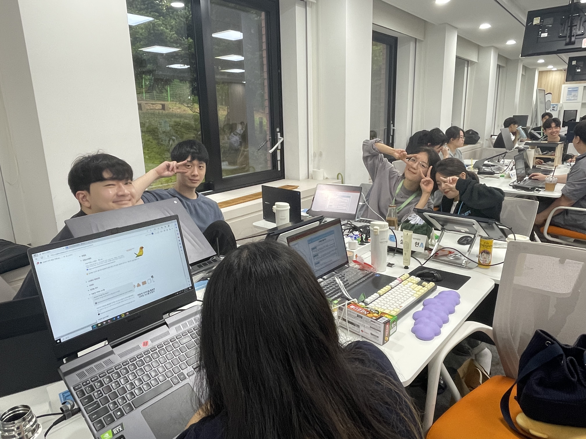
            </a>
        </td>
        <td>
            <a href="assets/그라운드룰적는중.jpg">
                
            </a>
        </td>
        <td>
            <a href="assets/인증샷.jpg">
                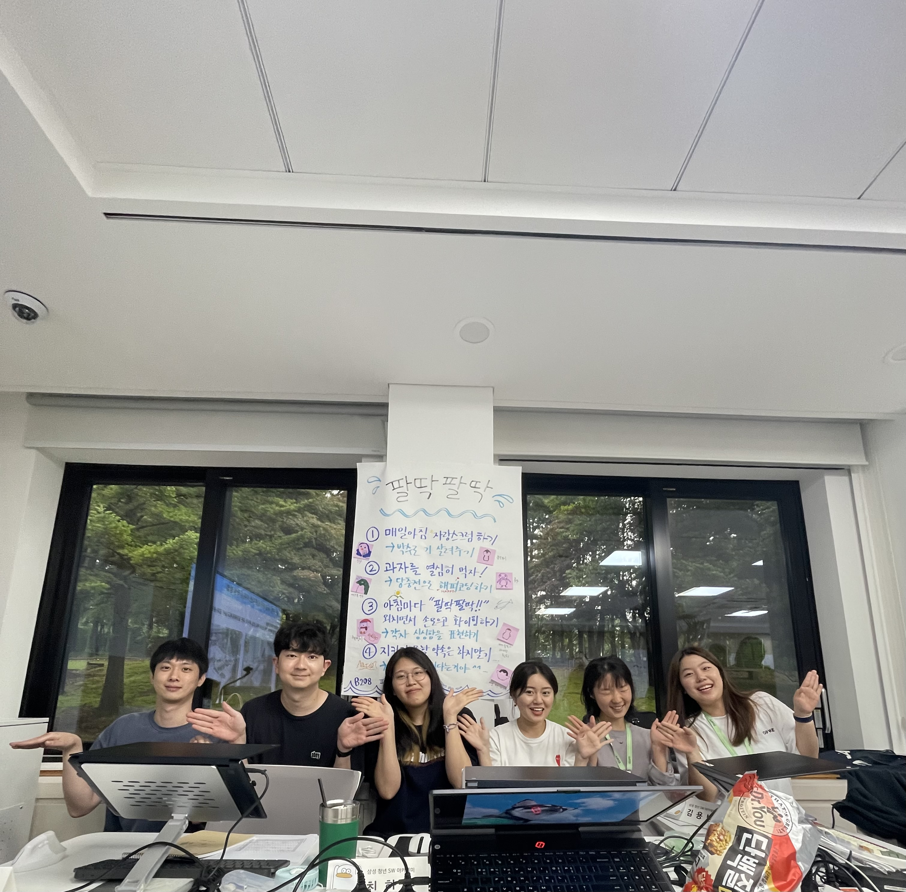
            </a>
        </td>
    </tr>
    <tr>
        <td align="center">부트캠프 첫날!</td>
        <td align="center">그라운드 룰 적는 중~!</td>
        <td align="center">그라운드 룰 앞에서 인증 샷!</td>
    </tr>   
    <tr>
        <td>
            <a href="assets/그라운드룰.jpg">
                
            </a>
        </td>
        <td>
            <a href="assets/소개이미지.png">
                
            </a>
        </td>
        <td>
            <a href="assets/소개컨셉.png">
                
            </a>
        </td>
    </tr>
    <tr>
        <td align="center">부트캠프 첫날!</td>
        <td align="center">우리팀 소개 이미지</td>
        <td align="center">우리팀 소개 컨셉</td>
    </tr>
    <tr>
        <td>
            <a href="assets/인생네컷.jpg">
                
            </a>
        </td>
        <td>
            <a href="assets/회식.jpg">
                
            </a>
        </td>
        <td>
            <a href="assets/코로나이슈.jpg">
                
            </a>
        </td>
    </tr>
    <tr>
        <td align="center">첫 인생네컷</td>
        <td align="center">팔딱팔딱 조~! 첫 회식!</td>
        <td align="center">코로나 이슈로… 3명 불참</td>
    </tr>
    <tr>
        <td>
            <a href="assets/신발던지기.png">
                
            </a>
        </td>
        <td>
            <a href="assets/자리정하기.jpg">
                
            </a>
        </td>
        <td>
            <a href="assets/그냥.jpg">
                
            </a>
        </td>
    </tr>
    <tr>
        <td align="center">자리 정하기 게임(신발던지기)</td>
        <td align="center">자리 정하기 게임(제로게임)</td>
        <td align="center">그냥 만들어 본 우리팀 소개</td>
    </tr>
    <tr>
        <td align="center">첫 인생네컷</td>
        <td align="center">팔딱팔딱 조~! 첫 회식!</td>
        <td align="center">코로나 이슈로… 3명 불참</td>
    </tr>
    <tr>
        <td>
            <a href="assets/중간발표.jpg">
                
            </a>
        </td>
        <td>
            <a href="assets/ucc비하인드.jpg">
                
            </a>
        </td>
        <td>
            <a href="assets/야근.jpg">
                
            </a>
        </td>
    </tr>
    <tr>
        <td align="center">중간 발표!</td>
        <td align="center">코코페이 UCC 비하인드</td>
        <td align="center">최종발표 전 마지막 야근!</td>
    </tr>  
    <tr>
        <td>
            <a href="assets/ucc비하인드2.jpg">
                
            </a>
        </td>
        <td>
            <a href="assets/스벤.jpg">
                
            </a>
        </td>
        <td>
            <a href="assets/인생네컷2.png">
                
            </a>
        </td>
    </tr>
    <tr>
        <td align="center">코코페이~~ 우리팀 진짜진짜 사랑합니다! 
        <br>
          우리 이멤버 포에버~~</td>
        <td align="center">명예멤버인 혜현언니의 스벤~~ </td>
        <td align="center">최종 끝나고 인생네컷! 모두모두 수고했다!</td>
    </tr>
</table>
